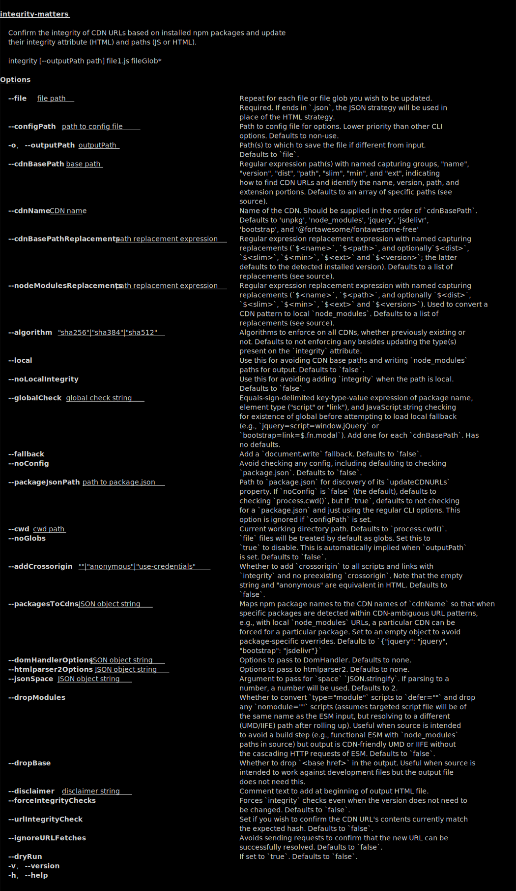

[](https://www.npmjs.com/package/integrity-matters)
[](https://david-dm.org/brettz9/integrity-matters)
[](https://david-dm.org/brettz9/integrity-matters?type=dev)

[](badges/eslint-badge.svg)

<!--
[](https://travis-ci.com/github/brettz9/integrity-matters)
[](badges/tests-badge.svg)
[](badges/coverage-badge.svg)
-->

[](https://snyk.io/test/github/brettz9/integrity-matters)
[](https://lgtm.com/projects/g/brettz9/integrity-matters/alerts)
[](https://lgtm.com/projects/g/brettz9/integrity-matters/context:javascript)

<!--[](LICENSE-MIT.txt)-->
[](badges/licenses-badge.svg)

(see also [licenses for dev. deps.](https://raw.githubusercontent.com/brettz9/integrity-matters/master/badges/licenses-badge-dev.svg?sanitize=true))

[](https://issuehunt.io/r/brettz9/integrity-matters)

# integrity-matters

Integrity matters! See [Motivation](#motivation).

## Features

1. **Confirm and update `integrity` and path info** - Confirm the integrity of
    CDN URLs based on currently installed npm packages and modify their
    integrity attribute (HTML) and paths (JS or HTML) to reflect the current
    local version and its contents.
1. **Auto-check CDN URLs** - Confirms that the converted CDN URLs can be
    visited successfully.
1. **File output options**:
    1. Overwriting an existing file - useful for Github Pages demos which you
        want to use with CDNs without an extra build step.
    1. Convert to a local path - useful if you want a local-only build,
        but are storing your source with CDN URLs.
    1. Creating a new file - provides the ability to still have scripts and
        links output with integrity attributes and versioned CDN URLs, but
        while only needing to save scripts/links to local paths in source,
        thereby avoiding version numbers or integrity attributes which are
        likely to produce larger diff noise upon updates.
1. **CDN fallbacks** - Option to detect if globals have loaded by the CDN and
    fallback to a local script if not.
1. **Inject `crossorigin`** - Option to inject `crossorigin` attributes.

## Motivation

Integrity matters, particularly when it comes to third-party sites. A
malicious or compromised CDN could serve files to your users that are
different than those of the package you are expecting.

Even if the CDN is run by the same author as that of a package you have
audited locally, you may wish to verify the CDN is indeed hosting the same
contents as the local files you may have checked (or is at least the same
as that hosted on npm).

[Subresource integrity](https://developer.mozilla.org/en-US/docs/Web/Security/Subresource_Integrity),
via the HTML `integrity` attribute, allows browsers to confirm that the
external script or stylesheet you are referencing holds a match for the same
contents as are expected.

## Installation

```sh
npm i -D integrity-matters
```

## CLI Usage



## To-dos

1. Implement `JSONStrategy`
1. Tests/Coverage (and uncomment badges in README)
2. See about getting HTML parser to preserve whitespace between attributes
    so that preserves preexisting whitespace when re-serialized?
    Seems `cheerio` is using
    [dom-serializer](https://github.com/cheeriojs/dom-serializer/blob/master/src/index.ts)
    (`render` -> `renderNode` -> `renderTag` -> `formatAttributes`); could pass
    metadata (in addition to `attribs`); but need to add metadata in
    [domhandler](https://github.com/fb55/domhandler/blob/master/src/index.ts#L147)
    perhaps long lines of workaround at
    <https://github.com/fb55/htmlparser2/issues/421>

## Potential to-dos

1. Deterministic logging order
1. Add some auto-fallbacks, e.g., `window.jQuery` for well-known libraries?
1. Could make optional to only update URL if that version is lower
    than the `package.json` range
1. Could use `esquery` to find `import` statements (e.g., see usage in
    `es-file-traverse`) though wouldn't allow updating integrity--only
    the version (and only Deno currently supports full URLs).
